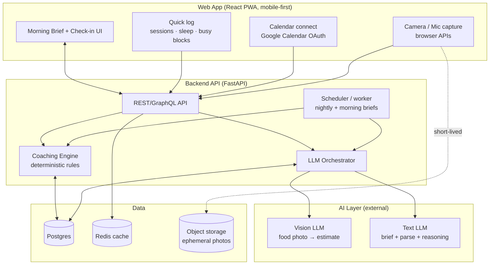

# Technical Design & Work Plan — "Corner"
### Cross-domain personal coach · companion to PRD v0.1

*Status: Draft v0.2 · Owner: Yaniv Keren · Last updated: 3 Sep 2026*
*v0.2: client is a web app (PWA), not a native iOS app. Health-platform reads move to Phase 2+; Phase 0–1 inputs are in-app logging and calendar integration.*
*Read alongside: PRD-Corner-personal-coach.md*

---

## 1. Scope & Guiding Principles

This design covers the **thin-slice MVP through Phase 1** (morning brief → frictionless food → cross-domain re-planning). It deliberately over-invests in de-risking the two hard problems early — **food estimation** and the **cross-domain reasoning engine** — and keeps everything else boring and cheap.

Four principles drive every decision below:

1. **Rules for math and safety, LLM for language and estimation.** Never let a language model decide a calorie floor or a recovery rule. Let it *explain*, *parse messy input*, and *estimate from a photo*. This keeps the product safe, cheap, testable, and trustworthy.
2. **Buildable by one-to-few people.** Managed services over self-hosted infra; one codebase where possible. This is a lean venture, not a platform org.
3. **Health data is radioactive.** Minimize what we store, encrypt everything, keep raw signals on-device where we can. (You're EU/Israel-adjacent — treat this as GDPR-grade from day one.)
4. **Every recommendation is explainable and reversible.** The architecture must always be able to answer "why did it say that?" — which is easier with rules-first design.

---

## 2. High-Level Architecture

**Flow in one sentence:** the client streams health + calendar + capture events to the backend; a deterministic engine maintains the "one budget" state and the safety rails; an LLM orchestrator handles food estimation, natural-language briefs, and reasoning; nightly and morning jobs pre-compute the plan so the brief opens instantly.

---

## 3. Recommended Stack

| Layer | Recommendation | Why | Main tradeoff |
|---|---|---|---|
| **Client** | Web app: React + Vite, installable PWA, mobile-first | No app-store cycle, one URL, matches your React background; camera/mic via browser APIs | No HealthKit/Health Connect from a browser — movement data comes from in-app logging and, later, wearable/Strava APIs |
| **Backend** | Python + FastAPI | Clean async, great for LLM orchestration, matches your Python tooling | Python concurrency ceiling — irrelevant at this scale |
| **DB** | Postgres (managed — Supabase / Neon / RDS) | Relational fits the day/activity/meal model; JSONB for flexible estimate blobs | — |
| **Cache / queue** | Redis | Cache briefs, rate-limit, lightweight job queue | — |
| **Jobs** | Managed scheduler (or Celery/RQ) | Nightly re-plan + morning brief pre-compute | — |
| **Vision LLM** | Multimodal model (Claude / GPT-class) via API | Photo → structured food estimate without training a model | Cost/latency per call; accuracy must be validated (see §4.2) |
| **Text LLM** | Same provider, smaller/faster model | Brief generation, voice parse, reasoning narration | — |
| **Object storage** | S3-class, short TTL | Hold food photos only long enough to estimate, then delete | — |
| **Auth** | Managed (Supabase Auth / Clerk / Auth0) | Don't hand-roll auth on health data | — |

**Platform decision (v0.2): web app first.** A mobile-first PWA ships without an app-store cycle, works on every phone from one URL, and keeps the first cut fast. The cost is health-platform access: a browser cannot read HealthKit or Health Connect, so movement and sleep enter through a ten-second in-app log in Phase 0–1, with Strava / Garmin / Oura-style APIs as the Phase 2+ path to automatic capture. A native wrapper (Capacitor) is the fallback if automatic health capture proves essential for retention.

---

## 4. Core Components (deep dives)

### 4.1 Coaching Engine — the "one budget" model *(deterministic)*

A pure, testable module that holds the day's connected state and enforces rules. **No LLM here.**

- **Inputs:** movement data (steps, workouts, HR/recovery if available), logged meals (estimates), calendar events, user profile & goals, historical adherence.
- **State it maintains:** a daily *energy & recovery ledger* — rough energy in/out, training load vs. recovery, and how one domain's change propagates to the others.
- **Outputs:** for each domain, a recommendation + a machine-readable **reason code** (e.g. `HARD_RUN_YESTERDAY → EASE_TRAINING`). Reason codes are what the LLM later turns into friendly prose, and what makes every suggestion explainable.
- **Safety rails live here:** minimum intake floors, max deficit, over-training caps (§7). These are hard constraints the rest of the system cannot override.

Keep this deterministic so it's unit-testable, cheap, instant, and auditable. This is the module that must never be "creative."

### 4.2 Food Estimation Pipeline — *the make-or-break spike*

Two entry paths, one output contract:

1. **Photo:** image → vision LLM → structured estimate `{items[], portion, rough_energy, macros_optional, confidence}`.
2. **Voice/text:** "had a burrito and a coke" → text LLM parse → same structured estimate.

Design rules:
- **Always return a usable estimate.** Low confidence → proceed with a sensible default and a soft, optional "was it closer to X or Y?" — never block or interrogate (PRD P0.2).
- **"Good enough," not gram-accurate.** We're steering daily behavior, not doing clinical accounting. Bias toward stable, unshaming ranges.
- **Photos are ephemeral.** Estimate, then delete the image (privacy + cost).
- **Cache common foods** the user logs repeatedly to cut cost and latency.

> ⚠️ **This is the #1 technical risk.** Before committing to Phase 1, run a **2-week accuracy spike** (§8, Spike 0): feed a labeled set of real meal photos + voice descriptions, measure estimate error and — more importantly — whether "good-enough" estimates still drive *correct daily recommendations*. If vision-LLM accuracy is too poor, fall back options are: constrained input ("pick the closest of these"), a lightweight food DB assist, or narrowing v1 to voice-only. Decide from data, not vibes.

### 4.3 LLM Orchestrator — *language & reasoning*

Thin layer that turns engine state + reason codes into user-facing output and parses messy input back into structured data.

- **Morning brief generation:** engine produces the plan + reason codes → LLM renders the 3-line brief in the user's coaching tone. Pre-computed by the morning job so the app opens instantly.
- **Voice/photo parsing:** natural input → structured estimate (feeds 4.2).
- **Reasoning narration:** on-demand "why did you say that?" expansions.
- **Guardrails:** strict output schemas, validation on every LLM response, safety-critical numbers *only* from the engine — the LLM never invents a target. Log prompts/outputs for evaluation.
- **Cost/latency:** briefs are ~1 cheap call/user/day (batched overnight); food estimates a handful/user/day. Trivial at MVP scale; add per-user rate limits and caching before growth.

### 4.4 Integrations

| Integration | v1 approach | Notes |
|---|---|---|
| **Movement & sleep** | In-app quick log (session type, minutes, how hard; hours slept) | Phase 2+: Strava / Garmin / Oura APIs for automatic capture |
| **Calendar** | Manual busy blocks (Phase 0) → Google Calendar OAuth read (Phase 1) | Only event times + coarse type leave the client; titles are never stored |
| **Push** | Web Push (VAPID) | Morning brief nudge, gentle comeback nudge; works on iOS 16.4+ when installed to the home screen |

Store as little raw third-party data as possible — derive what the engine needs, keep the rest on-device.

---

## 5. Data Model (core tables)

| Table | Key fields | Purpose |
|---|---|---|
| `users` | id, auth_ref, created_at | Account |
| `profiles` | user_id, goals, constraints, baseline stats | Personalization inputs (kept minimal & sensitive-flagged) |
| `days` | user_id, date, ledger_json, plan_json, status | The daily "one budget" snapshot + generated plan |
| `activities` | user_id, ts, type, source, load_metrics | Normalized movement (quick log now; wearable APIs later) |
| `meals` | user_id, ts, estimate_json, confidence, input_type | Food check-ins (no stored photo) |
| `cal_events` | user_id, start, end, coarse_type | Minimal calendar-derived events |
| `recommendations` | day_id, domain, value, reason_code, status | Each rec + why + accepted/overridden |
| `feedback` | user_id, rec_id, action, ts | Overrides & responses → feeds adaptive tone (P1) |
| `coaching_profile` | user_id, tone_weights, learned_signals | The B-bet: which nudges work (starts empty, learns) |

Notes: `*_json` are JSONB for flexible estimate/plan blobs. Sensitive columns (profile stats, health-derived metrics) get column-level encryption and are excluded from any analytics/export path.

---

## 6. Privacy, Security & Safety

- **Data minimization:** derive-and-discard. Photos deleted post-estimate; raw calendar not persisted; only coarse event types stored.
- **Encryption:** at rest (DB + storage) and in transit; column-level encryption for health-derived fields.
- **Consent & control:** explicit per-source permission (health, calendar); one-tap export & delete.
- **Regulatory:** treat as GDPR-grade — lawful basis, data-processing records, retention limits.
- **Safety rails (in the engine, §4.1):** minimum intake floors, capped deficits, over-training limits, no extreme-restriction plans, non-clinical framing. The comeback-friendly design is itself a safety feature. These are **hard constraints**, not suggestions the LLM can talk around.

---

## 7. Key Technical Risks

| Risk | Severity | Mitigation |
|---|---|---|
| Food estimation not accurate enough to drive good recs | **High** | Spike 0 before Phase 1; fallbacks ready (constrained input / voice-only / DB assist) |
| LLM produces unsafe or off numbers | High | Numbers only from deterministic engine; LLM output validated against schema + rails |
| Cross-domain logic feels wrong → trust collapses | High | Explainable reason codes + one-tap override; tune re-plan acceptance rate (PRD §7) |
| Manual logging friction (no health-platform read on web) | Medium | Ten-second log, brief still works on partial data; calendar OAuth in Phase 1; wearable APIs in Phase 2+ |
| LLM cost/latency at scale | Low now | Pre-compute briefs, cache foods, rate-limit; revisit at growth |

---

## 8. Work Plan

Phasing mirrors the PRD. **Spikes come before committed builds** so the risky unknowns are resolved with data.

### Spike 0 — Food-data feasibility *(before anything else, ~2 weeks)*
- Assemble a labeled test set of real meal photos + voice descriptions.
- Measure vision/text-LLM estimate error **and** whether "good-enough" estimates still yield correct daily recommendations.
- **Exit gate:** go / adjust-approach / narrow-scope decision. *Nothing in Phase 1 starts until this passes.*

### Phase 0 — Thin-slice MVP *(Morning Brief that reads your week)*
- **M0.1** Skeleton: React web app (PWA), FastAPI backend, Postgres, auth.
- **M0.2** Quick log (sessions, sleep, busy blocks); Google Calendar read follows in Phase 1.
- **M0.3** Deterministic engine v1: qualitative food focus + movement rec + calendar-aware shift, emitting reason codes.
- **M0.4** LLM orchestrator: render the 3-line brief from engine output.
- **M0.5** Morning job pre-computes brief; push nudge; instant open.
- **Milestone / success:** a real user opens the brief and feels *"it thought about my actual day."* (PRD leading metric: brief open rate.)

### Phase 1 — Frictionless food + full re-planning
- **M1.1** Food estimation pipeline (photo + voice) → structured estimate (built on Spike 0's chosen approach).
- **M1.2** Engine v2: full "one budget" ledger — food ⟷ training ⟷ cardio ⟷ recovery propagation.
- **M1.3** Live re-planning on disruption (missed session, long meeting).
- **M1.4** Overrule + reasoning-on-demand end to end.
- **Milestone / success:** logging a hard workout visibly re-shapes today's food and tomorrow's training, with a reason — under-10-second check-ins.

### Phase 2 — Adaptive coaching + reflection
- **M2.1** Capture override/response signals → `coaching_profile`.
- **M2.2** Tone adaptation in brief generation (the B bet).
- **M2.3** Evening reflection + tomorrow preview; comeback flow hardening.
- **Milestone / success:** measurable lift in Day-42 retention vs. Phase 1 cohort.

### Phase 3 — Depth *(post-validation)*
- Wearable / Strava-class integrations for automatic movement capture; richer recovery signals; opt-in precision mode; private accountability partner; native wrapper if health-platform access proves essential.

---

## 9. Open Technical Decisions

*Blocking:*
- ~~**Platform first**~~ — decided: web app (PWA) first (see §3).
- **Food approach** — pending **Spike 0** outcome.
- **LLM provider(s)** — pick primary + fallback; validate vision accuracy and data-handling terms.

*Non-blocking (settle during build):*
- Rules ⟷ LLM boundary line — start rules-heavy, expand LLM only where it earns trust.
- GraphQL vs REST — REST is fine for MVP; revisit if the client grows chatty.
- Managed-DB choice (Supabase vs Neon vs RDS) — pick on auth + ops preference.

---

*Next artifacts available on request: the Spike 0 test protocol (how to actually measure food-estimate quality), an engineering ticket breakdown for Phase 0 milestones, or an architecture decision record (ADR) for the rules-vs-LLM boundary.*
